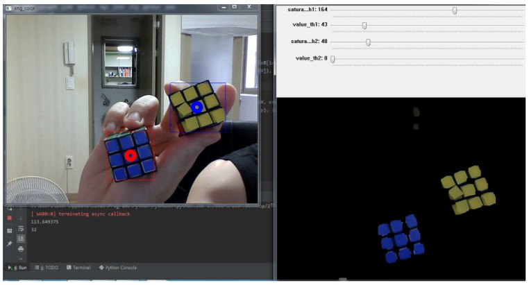

# opencv-test
> OpenCV 라이브러리 연습



## Installation

Windows:

PyCharm 2019로 실행함

## Usage example

OpenCV 라이브러리를 이용하여 그레이스케일, 이진화, 컨투어, 엣지 검출, 직선 검출, 색 검출, 도형 검출, 템플릿 매칭 등 일련의 과정을 수행함


## Development setup

Describe how to install all development dependencies and how to run an automated test-suite of some kind. Potentially do this for multiple platforms.

```python
pip install opencv-contrib-python
```


## Release History

* 1.0.0
    * First Commit
    * 실습 완료

## Meta

김준혁 – wnsgur1198@naver.com

[https://github.com/wnsgur1198/opencv-test/]

## Contributing

1. Fork it (<https://github.com/yourname/yourproject/fork>)
2. Create your feature branch (`git checkout -b feature/fooBar`)
3. Commit your changes (`git commit -am 'Add some fooBar'`)
4. Push to the branch (`git push origin feature/fooBar`)
5. Create a new Pull Request

<!-- Markdown link & img dfn's -->
